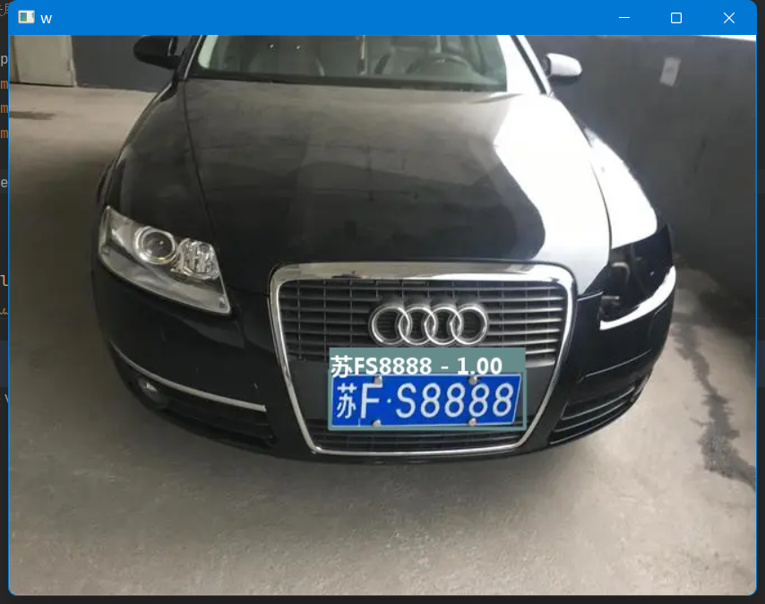

## HyperLPR3   高性能开源中文车牌识别框架

#### [](https://pypi.org/project/hyperlpr3/)[](https://pypi.org/manage/project/hyperlpr3/releases/)[](https://jitpack.io/#HyperInspire/hyperlpr3-android-sdk)

### 一键安装

`python -m pip install hyperlpr3`

###### 支持python3, 支持Windows  Mac Linux 树莓派等。

###### 720p cpu real-time (st on MBP r15 2.2GHz haswell).

#### 快速体验

```bash
# 使用命令行测试 - 图像url地址
lpr3 sample -src https://koss.iyong.com/swift/v1/iyong_public/iyong_2596631159095872/image/20190221/1550713902741045679.jpg

# 使用命令行测试 - 本地图像路径
lpr3 sample -src images/test_img.jpg -det high
```

#### 快速上手

```python
# 导入opencv库
import cv2
# 导入依赖包
import hyperlpr3 as lpr3

# 实例化识别对象
catcher = lpr3.LicensePlateCatcher()
# 读取图片
image = cv2.imread("images/test_img.jpg")
# 识别结果
print(catcher(image))
```

#### Q&A

Q：车牌的训练数据来源？

A：由于用于训练车牌数据涉及到法律隐私等问题，本项目无法提供。开放较为大的数据集有[CCPD](https://github.com/detectRecog/CCPD)
车牌数据集。

Q：训练代码的提供？

A：相关资源中有提供老版的训练代码，HyperLPR3的训练方法会陆续整理并给出。

Q：关于项目的来源？

A：此项目来源于作者早期的研究和调试代码，代码缺少一定的规范，同时也欢迎PR。

#### 相关资源

- [HyperLPR3车牌识别-五分钟搞定: 中文车牌识别光速部署与使用](https://blog.csdn.net/weixin_40193776/article/details/129258107)

#### 其他版本

- [HyperLPRv1版](https://github.com/szad670401/HyperLPR/tree/v1)

- [HyperLPRv2版](https://github.com/szad670401/HyperLPR/tree/v2)

### TODO

- 支持快速部署WebApi服务
- 支持多种车牌以及双层
- 支持大角度车牌
- 轻量级识别模型

### 特性

- 速度快 720p,单核 Intel 2.2G CPU (MaBook Pro 2015)平均识别时间低于100ms
- 基于端到端的车牌识别无需进行字符分割
- 识别率高,卡口场景准确率在95%-97%左右
- 支持跨平台编译和快速部署

### Python 依赖

- opencv-python (>3.3)
- onnxruntime (>1.8.1)
- fastapi (0.92.0)
- uvicorn (0.20.0)
- loguru (0.6.0)
- python-multipart
- tqdm
- requests

### 可识别和待支持的车牌的类型(中文)

#### 支持

- [x] 单行蓝牌
- [x] 单行黄牌
- [x] 新能源车牌
- [x] 教练车牌

#### 有限支持

- [x] 白色警用车牌
- [x] 使馆/港澳车牌
- [x] 双层黄牌
- [x] 武警车牌

#### 待支持

- [ ] 民航车牌
- [ ] 双层武警
- [ ] 双层军牌
- [ ] 双层农用车牌
- [ ] 双层个性化车牌
- [ ] 更多国家车牌

###### Note:由于训练的时候样本存在一些不均衡的问题,一些特殊车牌存在一定识别率低下的问题，如(使馆/港澳车牌)，会在后续的版本进行改进。

### 效果示例

  


